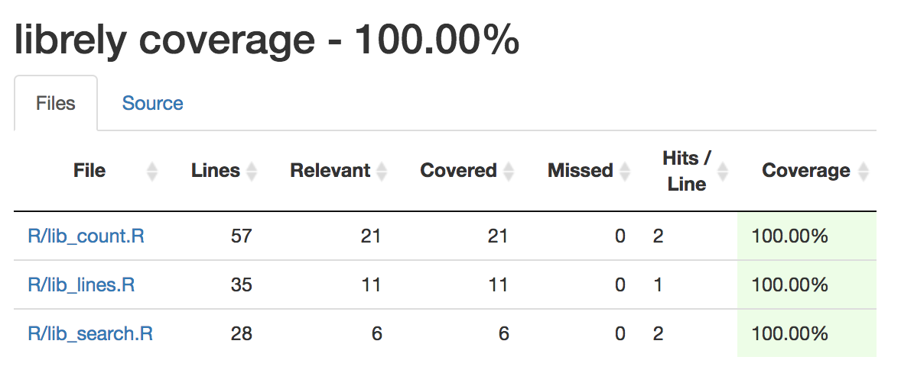

# LibRely (R)

### Collaborators
| Name | GitHub Handle |
| ---- | ------ |
| Alex Hope | [@ehhope ]( https://github.com/ehhope) |
| Zixin Zhang     | [@zxzzhangg](https://github.com/zxzzhangg) |
| Aaron Quinton     | [@aaronquinton](https://github.com/aaronquinton ) |

### Releases

[Milestone 1 Release](https://github.com/UBC-MDS/LibRely-R-/releases/tag/V1.0)


### Overview
The `LibRely` package is designed to provide a meta analysis of R scripts to aid in the workflow for a data science or software development project. The functionalities in this package interpret scripts to compile library/module dependencies, document specific functions imported in the script and measure the length of the script by the number of lines and characters.

The user can use `LibRely` to better understand the packages used in a script authored by someone else. Alternatively, a user can take advantage of the functionalities when preparing the ReadMe documentation in their project. The following functions are included in the `LibRely` package.

`lib_search()`

- Input parameter(string): a file path to the script
- Output parameter(list): a list of dependencies
- Function purpose: find and list the libraries/modules used in the script passed as an argument

`lib_count()`

- Input parameter(string): a file path to the script
- Output parameter(tibble): a dataframe that summarizes package, corresponding functions and number of usage
- Function purpose: count the functions used and detail their corresponding libraries/packages

 `lib_lines()`

 - Input parameter(string): a file path to the script
 - Output parameter(vector): a vector of two number where the first is the number of line and the second is the number of characters
 - Function purpose: count the number of lines and characters of the script

### Installation
You can install the released version of `LibRely` from [CRAN](https://CRAN.R-project.org) in R with:
```
devtools::install_github("UBC-MDS/LibRely")
```

### Branch Coverage Test
We use covr package for branch test. You can go to `LibRely.Rproj` and run the following command lines
```
install.packages("covr") # if you don't have it installed
library(covr)
report()
```
The results are shown below.




### Usage
This is a simple usage case of our package in R.
```r
library(LibRely)

> lib_search("tests/script_for_test1.R")
[1] "dplyr"  "tibble"

> lib_count("tests/script_for_test1.R")
# A tibble: 4 x 3
  package_name function_name count
  <chr>        <chr>         <int>
1 dplyr        mutate            1
2 dplyr        summarize_all     1
3 dplyr        tibble            1
4 tibble       tibble            1

> lib_lines("tests/script_for_test1.R")
$num_line
[1] 7

$num_char
[1] 193
```

### R Ecosystems

- **R**: We were not able to find any R software packages that address the same functionality as we intend to with ```LibRely```. Our package fits the R ecosystem because it analyzes a `.R` script and all these functions return common return types, like a vector, a list and a tibble.
